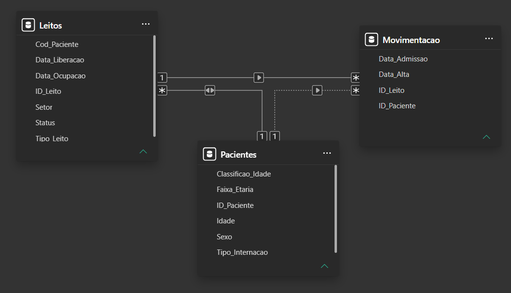
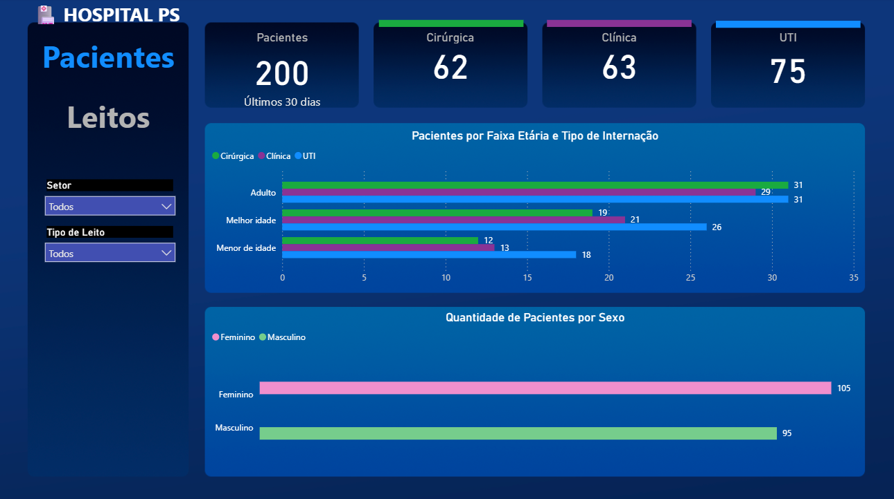
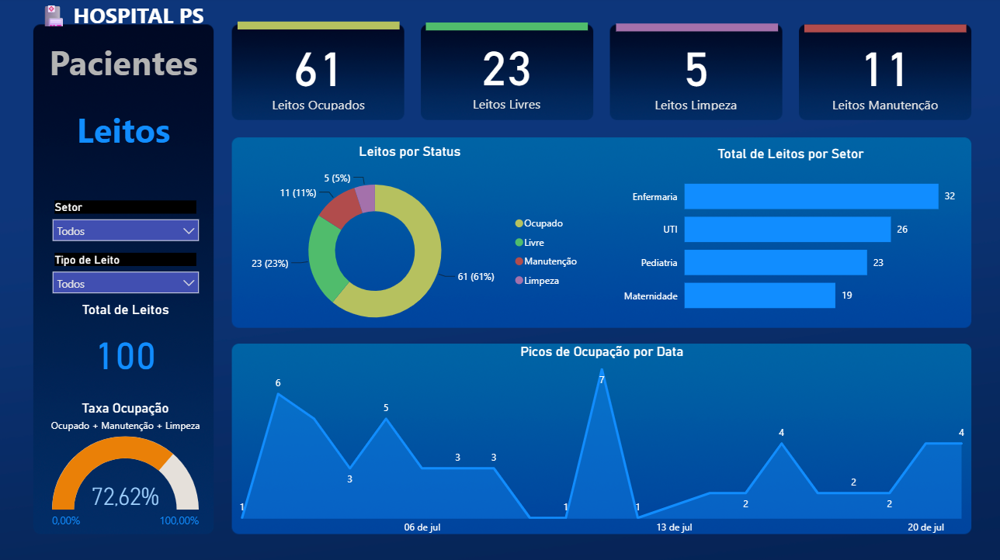

# 🏥 Análise de Dados Hospitalares — Pacientes e Leitos

Projeto desenvolvido durante o curso **Projeto Análise de Dados: Organização, tratamento e visualização** da **Alura**, com o objetivo de analisar, tratar e visualizar dados hospitalares relacionados a pacientes e ocupação de leitos.

O fluxo do projeto segue a lógica: **dados brutos → tratamento em Python (Jupyter) → arquivos tratados → dashboard interativo no Power BI**.

---

## 🎯 Objetivo

Simular um cenário real de análise de dados em um ambiente hospitalar, respondendo perguntas como:

- Qual a taxa de ocupação atual dos leitos?
- Como os leitos estão distribuídos por setor (Enfermaria, UTI, Pediatria, Maternidade)?
- Qual o perfil dos pacientes internados (faixa etária, sexo, tipo de internação)?
- Quais os picos de ocupação ao longo do tempo?

---

## 🛠️ Tecnologias utilizadas

- **Python** (Pandas, NumPy) — tratamento e organização dos dados
- **Jupyter Notebook** — desenvolvimento da análise
- **Power BI** — modelagem de dados e construção do dashboard

---

## 📁 Estrutura do repositório

```
analise-dados-hospitalares/
│
├── data/
│   ├── raw/                      # Dados brutos originais
│   └── processed/                # Dados tratados (saída do notebook)
│
├── notebooks/
│   └── analise-de-dados-hospitalares.ipynb   # Análise e tratamento dos dados
│
├── dashboard/
│   ├── dashboard_hospitalar.pbix             # Arquivo do Power BI
│   └── screenshots/                          # Prints das telas do dashboard
│
├── docs/
│   └── modelagem_dados.png        # Diagrama do modelo relacional
│
├── requirements.txt
└── README.md
```

---

## 🔄 Etapas do projeto

1. **Coleta dos dados brutos** — arquivos de origem com informações de pacientes, leitos e movimentação hospitalar.
2. **Tratamento dos dados** — realizado no notebook `analise-de-dados-hospitalares.ipynb`, com limpeza, padronização e geração de colunas auxiliares (ex.: classificação de idade, faixa etária).
3. **Exportação dos arquivos tratados** — salvos em `data/processed/`, prontos para consumo no Power BI.
4. **Modelagem de dados no Power BI** — construção do modelo relacional entre as tabelas.
5. **Construção do dashboard** — visualizações interativas para análise de pacientes e leitos.

---

## 🗂️ Modelagem de dados

O modelo relacional é composto por 3 tabelas principais:

| Tabela | Colunas |
|---|---|
| **Leitos** | Cod_Paciente, Data_Liberacao, Data_Ocupacao, ID_Leito, Setor, Status, Tipo_Leito |
| **Movimentacao** | Data_Admissao, Data_Alta, ID_Leito, ID_Paciente |
| **Pacientes** | Classificao_Idade, Faixa_Etaria, ID_Paciente, Idade, Sexo, Tipo_Internacao |



---

## 📊 Dashboard

### Tela — Pacientes

Visão geral da quantidade de pacientes, distribuição por tipo de internação (Cirúrgica, Clínica, UTI), faixa etária e sexo.



### Tela — Leitos

Acompanhamento de leitos ocupados, livres, em limpeza e manutenção, distribuição por setor, taxa de ocupação e picos de ocupação por data.



---

## ▶️ Como executar

```bash
# Clone o repositório
git clone https://github.com/vcbonani/analise-dados-hospitalares.git

# Instale as dependências
pip install -r requirements.txt

# Execute o notebook
jupyter notebook notebooks/analise-de-dados-hospitalares.ipynb
```

Para visualizar o dashboard, abra o arquivo `dashboard/dashboard_hospitalar.pbix` no Power BI Desktop.

---

## 👤 Autor

**Vinícius Cunha**
[GitHub](https://github.com/vcbonani)
